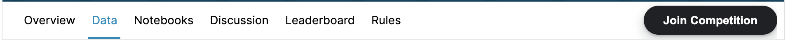
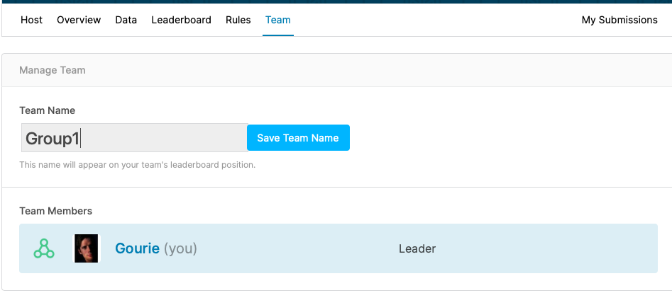
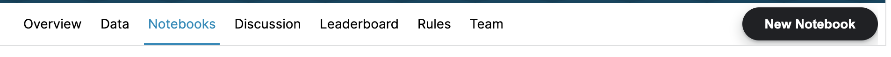
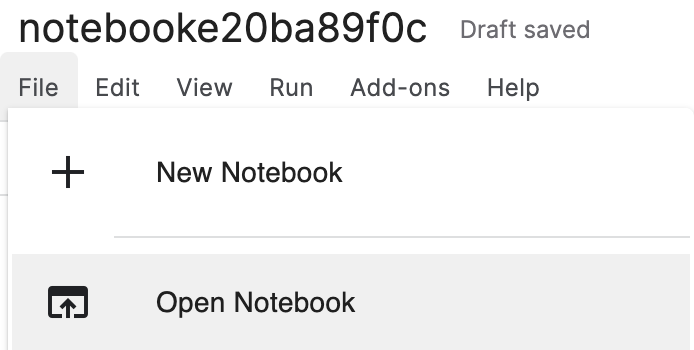
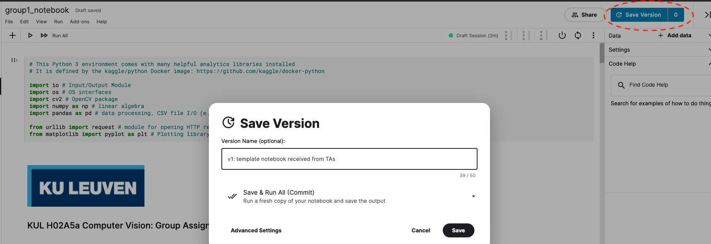
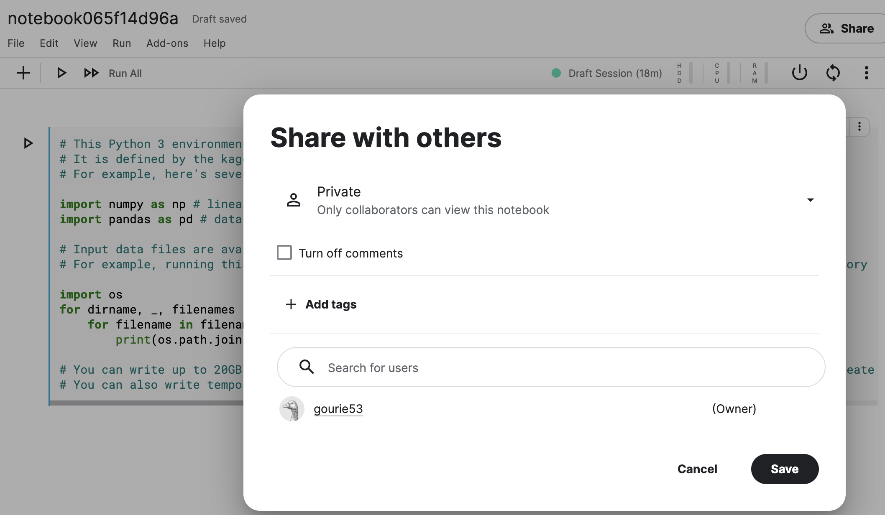
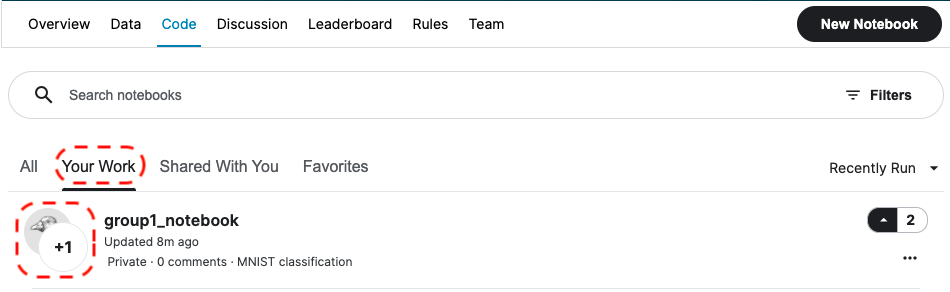
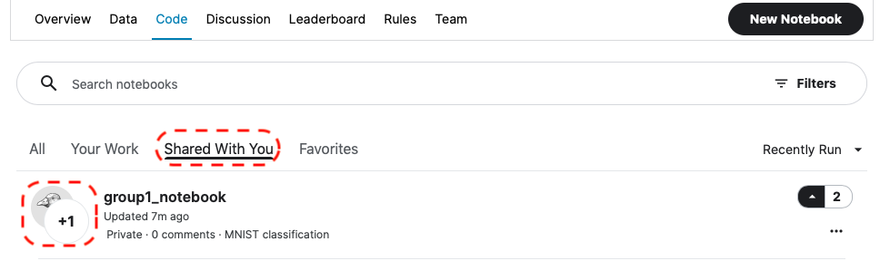
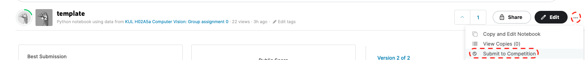

# kaggle inClass competition
This page describes how students can participate in a kaggle inClass competition organized by
their Teaching Assistants (TAs) for a KU Leuven course.

## overview
- step0: complete prerequisites
- step1: join the competition
- step2: setup kaggle team with template notebook
- step3: code and version your team notebook
- step4: submit your results

## step0: complete prerequisites
1. Create a kaggle account (if you don't have one yet, note that new users have to pass a few verification steps before all functions in kaggle work).
2. Find the url of the kaggle inClass competition in the Toledo *Assignment*.
3. Download the template notebook from Toledo.

## step1: join the competition
Every group member should login to kaggle.com, browse to the inClass competition website and join the competition.

## step2: setup kaggle team with template notebook
Each group will have to designate **one group leader** who will perform the following startup steps: 
1. The leader creates a team using the designated group name found on Toledo.

2. The leader imports the template notebook and shares this with all group members and the TAs (using their kaggle accounts).
    - create a New notebook
        
    - select File > Open Notebook to upload the template notebook that you downloaded from Toledo.
        
    - once the template notebook has been loaded, change the notebook name to **<group_name>_notebook** and save a first version.
        
    - share this notebook in *writer mode* with all the group members 
        
    - share the group notebook in *reader mode* with all the TAs to allow grading your submission for this course project.

## step3: code and version your team notebook
Now that your team has been setup, you can really get started with the assignment. 
1. The leader will find the notebook in the Code/Your Work section and see with whom it's shared:
    
2. For the other group members, the team notebook will appear in the Code/Shared With You section:
    
3. All group members can now start working on this team notebook. Each group member should save his/her work in new versions of the notebook.
You are free to manage these versions as you like (possibly outside kaggle), but please make sure to provide your final notebook
in the expected format yielding the expected outputs for submission.

## step4: submit results
Once you are ready, you can submit (intermediate) results to get a score on the Public Leaderboard. To submit, you should open 
your notebook and then select Submit to Competition behind the ... next to the Edit button: 

Note that the TAs will use your latest notebook which resulted in a successful submission to grade your submission so please make sure that this notebook contains 
your best and final results! 

## questions?
Please contact your TAs on Toledo.
