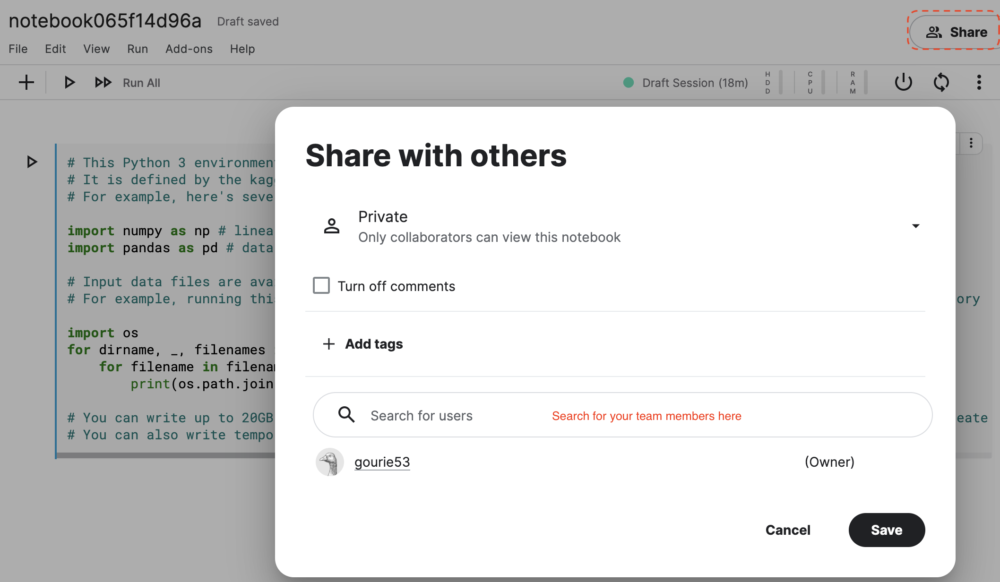

# kaggle inClass competition
This page describes how students should participate in a kaggle inClass competition organized by
their Teaching Assistants (TAs) for a KU Leuven course.

## overview
- step0: complete prerequisites
- step1: join the competition
- step2: create your team 
- step3: code notebook and submit your results
- step4: submit final results and share your notebook with TAs

## step0: complete prerequisites
1. Create a kaggle account (if you don't have one yet).
2. Find the url of the kaggle inClass competition on the Toledo course page.
3. Download the template notebook from the Toledo course page.

## step1: join the competition
Login to kaggle.com and browse to the inClass competition website. Next, hit join competition.

## step2: create your team
Each group will have to create a team using the group information provided on Toledo. 
Each group member should be added to this team to be able to jointly work on the submission notebook.

1. All group members need to join the competition and share their Kaggle accounts with **one** group member (the leader).
2. The leader creates a team using the designated group name found on Toledo .

3. The leader adds the other students by using the merge teams functionality. 

4. Each group member joins the team. 

## step3: code your notebook  and submit your results
Now your team can start working on the assignment. 
1. The leader imports the template notebook which is shared by default with all group members.
    - first, create a New notebook
        
    - then, select File > Open Notebook to upload the template notebook that you downloaded from Toledo.
        
    - finally, change the notebook name and save a version.
2. All group members can open the shared notebook and start working on their version of (part of) the notebook. All
members of the team can view each other's notebooks but editing will always create a new copy that needs to saved 
as a new notebook file. We recommend that you use distinct notebook filename to keep track of these different notebooks
and ensure proper submission of your final notebook in the end.
3. Once you are ready, submit the results to get a(n updated) score on the leaderboard (max 2 submissions per day allowed).

## step4: submit final results and share your notebook with TAs
To complete the assignment, each team must submit results at least once **and** share its notebook with the TAs 
(Kaggle account and email address are available on Toledo).

## questions?
Please contact your TAs on Toledo.
